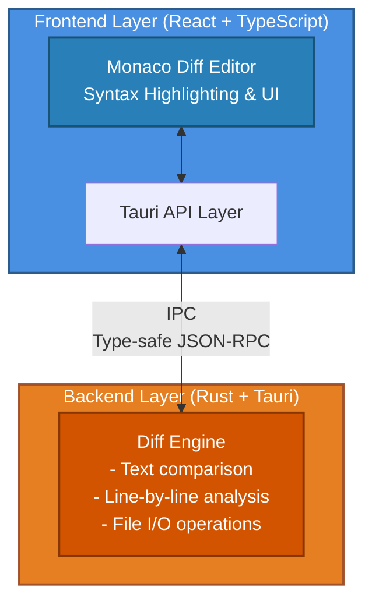

# Differential ☉

> A blazingly fast, cross-platform visual diff tool built with Tauri, React, and Rust.

[](https://opensource.org/licenses/MIT)
[](https://tauri.app)
[](https://www.typescriptlang.org/)
[](https://www.rust-lang.org/)

## Features

- **Blazingly Fast** - Rust-powered diff algorithms for instant comparison
- **Syntax Highlighting** - Support for 100+ programming languages via Monaco Editor
- **Beautiful UI** - Clean, modern interface powered by VS Code's editor
- **Lightweight** - ~15MB bundle size (vs 100MB+ for Electron alternatives)
- **Cross-Platform** - Native builds for macOS, Windows, and Linux
- **Real-time Diff** - See changes instantly as you load files
- **Side-by-Side View** - Synchronized scrolling and line highlighting
- **Drag & Drop** - Easy file loading with native file picker support

## Screenshots

> Coming soon

## Quick Start

### Prerequisites

- [Bun](https://bun.sh) >= 1.0
- [Rust](https://www.rust-lang.org/) >= 1.70
- [Node.js](https://nodejs.org/) >= 18 (for some build tools)

### Development

```bash
# Clone the repository
git clone https://github.com/seamusmullan/differential.git
cd differential

# Install dependencies
bun install

# Run in development mode
bun run tauri dev
```

### Building

```bash
# Build for production
bun run tauri build
```

The built application will be in `src-tauri/target/release/bundle/`.

## Architecture



## Tech Stack

### Frontend

- **React 19** - UI framework
- **TypeScript 5.8** - Type safety
- **Monaco Editor** - VS Code's text editor
- **Vite 7** - Fast build tool

### Backend

- **Rust** - Systems programming language
- **Tauri 2** - Desktop app framework
- **similar** - High-performance diff algorithm library

## Documentation

For detailed documentation, see the [docs](./docs) directory:

- [Architecture Overview](./docs/architecture.md)
- [Development Guide](./docs/development.md)
- [API Reference](./docs/api.md)
- [Contributing Guidelines](./CONTRIBUTING.md)

## Contributing

Contributions are welcome! Please read our [Contributing Guidelines](./CONTRIBUTING.md) first.

1. Fork the repository
2. Create your feature branch (`git checkout -b feature/amazing-feature`)
3. Commit your changes (`git commit -m 'Add some amazing feature'`)
4. Push to the branch (`git push origin feature/amazing-feature`)
5. Open a Pull Request

## License

This project is licensed under the MIT License - see the [LICENSE](./LICENSE) file for details.

## Acknowledgments

- [Tauri](https://tauri.app) - For the amazing desktop framework
- [Monaco Editor](https://microsoft.github.io/monaco-editor/) - For the powerful text editor
- [similar](https://github.com/mitsuhiko/similar) - For the fast diff algorithms

## Project Status

### [IN DEVELOPMENT] This project is currently in active development.

- [x] Project setup
- [ ] Core diff functionality
- [ ] Monaco Editor integration
- [ ] File system operations
- [ ] UI/UX polish
- [ ] Cross-platform builds
- [ ] Documentation
- [ ] v1.0 Release

## Contact

Seamus Mullan - [@seamusmullan](https://github.com/seamusmullan)

Project Link: [https://github.com/seamusmullan/differential](https://github.com/seamusmullan/differential)
