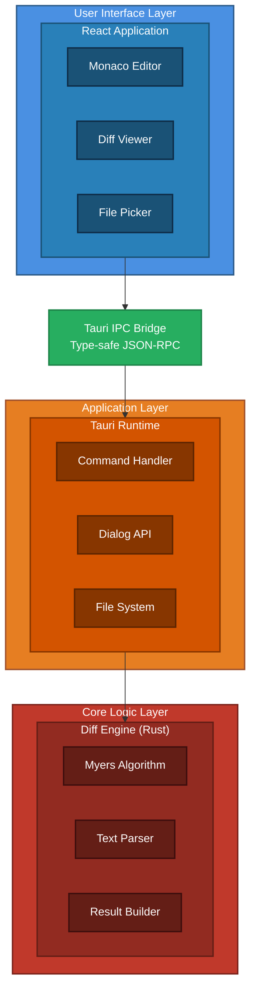
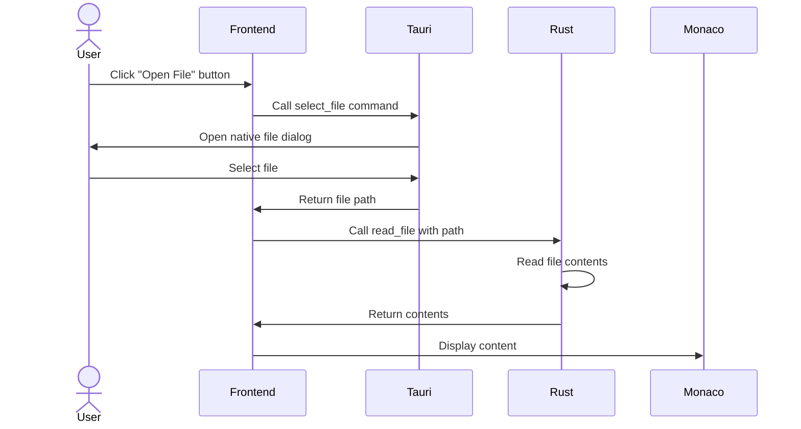
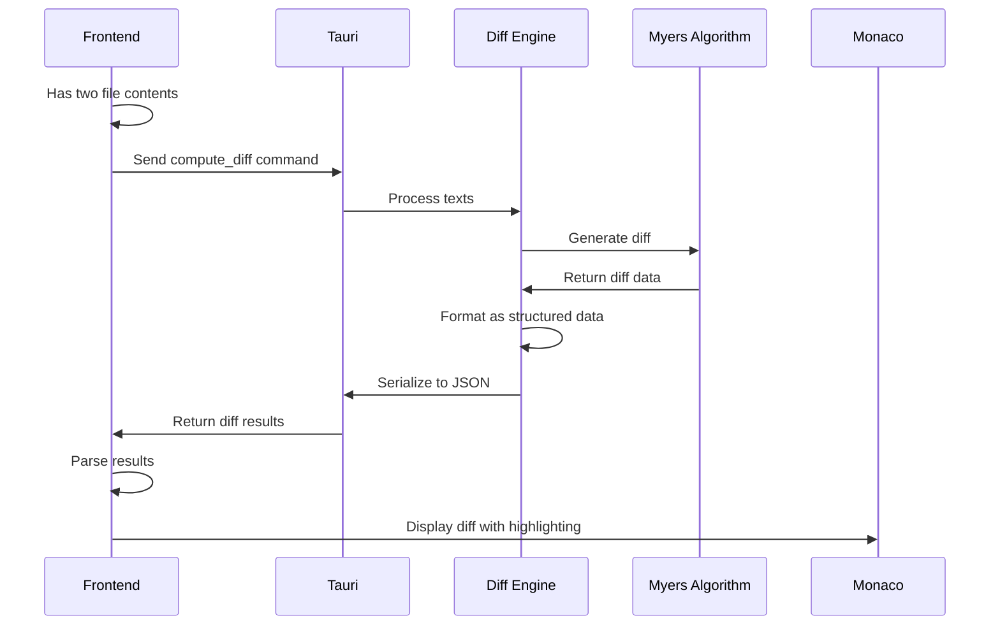

# Differential Architecture ☉

## Overview

Differential is a cross-platform visual diff tool built with a modern hybrid architecture combining the performance of Rust with the flexibility of web technologies.

## Architecture Diagram



## Component Breakdown

### Frontend Layer (React + TypeScript)

#### Monaco Editor Component

- **Purpose**: Renders the diff view with syntax highlighting
- **Features**:
  - Side-by-side diff display
  - Syntax highlighting for 100+ languages
  - Line numbering and gutter decorations
  - Scroll synchronization
- **Integration**: Uses Monaco's built-in `createDiffEditor` API

#### File Picker Component

- **Purpose**: Allows users to select files for comparison
- **Features**:
  - Native file dialog integration
  - Drag and drop support
  - Recent files list
  - File path display

#### Diff Viewer Component

- **Purpose**: Main application container
- **Features**:
  - Layout management
  - State coordination
  - Toolbar and controls
  - Status bar

### Backend Layer (Rust + Tauri)

#### Command Handlers

- **Purpose**: Bridge between frontend and Rust logic
- **Commands**:
  - `compute_diff`: Computes diff between two strings
  - `read_file`: Reads file contents
  - `select_file`: Opens native file picker
- **Type Safety**: Uses `serde` for JSON serialization

#### Diff Engine

- **Purpose**: High-performance text comparison
- **Algorithm**: Myers diff algorithm (via `similar` crate)
- **Features**:
  - Line-by-line comparison
  - Character-level diff
  - Optimized for large files
  - Streaming results for huge files

#### File System Operations

- **Purpose**: Secure file access
- **Features**:
  - Cross-platform file reading
  - Path validation
  - Error handling
  - Permission checks

## Data Flow

### Opening Files



### Computing Diff



## Technology Choices

### Why Tauri?

- **Small Bundle Size**: 10-20MB vs 100MB+ for Electron
- **Better Performance**: Native code execution
- **Security**: Sandboxed by default
- **Cross-Platform**: Single codebase for all platforms

### Why Monaco Editor?

- **Battle-Tested**: Powers VS Code
- **Rich Features**: Built-in diff mode
- **Syntax Highlighting**: 100+ languages out of the box
- **Accessibility**: ARIA support, keyboard navigation

### Why Rust for Diff?

- **Performance**: Orders of magnitude faster than JavaScript
- **Memory Safety**: No undefined behavior
- **Concurrency**: Easy parallel processing
- **Ecosystem**: Excellent diff libraries (`similar`, `dissimilar`)

## Performance Considerations

### File Size Limits

- **Small files** (<1MB): Instant diff
- **Medium files** (1-10MB): Sub-second diff
- **Large files** (>10MB): Streaming diff or chunking

### Memory Management

- **Frontend**: Monaco handles large documents efficiently
- **Backend**: Rust's ownership system prevents memory leaks
- **IPC**: Only diff results cross the boundary, not full files

### Optimization Strategies

1. **Lazy Loading**: Only compute visible diff regions
2. **Caching**: Cache diff results for repeated comparisons
3. **Parallel Processing**: Use multiple cores for large files
4. **Streaming**: Process files in chunks if needed

## Security Model

### Tauri Security Features

- **CSP**: Content Security Policy enforcement
- **API Allowlisting**: Only exposed commands are callable
- **Path Validation**: File system access is restricted
- **No Remote Code**: All code is bundled

### File Access

- Users must explicitly select files via dialog
- No automatic directory scanning
- Read-only operations (no file writing in v1)

## Extensibility

### Future Architecture Additions

1. **Plugin System**: Allow custom diff algorithms
2. **Git Integration**: Compare commits, branches
3. **Merge Tools**: Three-way merge support
4. **Remote Files**: Compare files from URLs or APIs
5. **Database Support**: Compare database schemas

## Build Pipeline

```text
Development:
  Frontend: Vite dev server (HMR)
  Backend: Cargo watch (auto-rebuild)
  Integration: Tauri dev mode

Production:
  1. Vite builds optimized bundle
  2. Cargo compiles release binary
  3. Tauri packages for target platform
  4. Platform-specific installers generated
```

## Cross-Platform Considerations

### macOS

- Uses system WebView (WebKit)
- .dmg and .app bundle
- Code signing required for distribution

### Windows

- Uses WebView2 (Chromium)
- .msi installer
- Windows Defender SmartScreen considerations

### Linux

- Uses WebKitGTK
- .deb, .rpm, .AppImage
- Distribution-specific packaging

## Testing Strategy

### Unit Tests

- Rust: `cargo test`
- TypeScript: Vitest (future)

### Integration Tests

- Tauri test commands
- Mock IPC calls

### E2E Tests

- Playwright/WebDriver (future)
- Automated UI testing

## Deployment

### Release Process

1. Version bump in `package.json` and `Cargo.toml`
2. Update CHANGELOG
3. Run `bun run tauri build`
4. Sign binaries (platform-specific)
5. Upload to GitHub Releases
6. Update documentation

### Auto-Updates (Future)

- Tauri updater integration
- Delta updates for efficiency
- Background download and install
